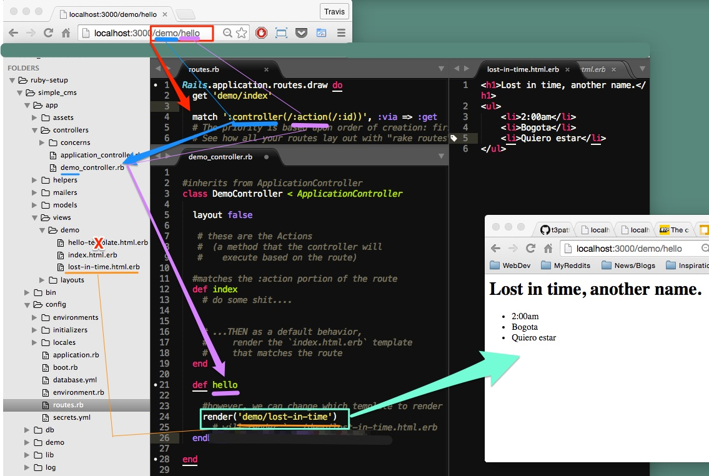

##Routes & Views

### Server Requests in Ruby
- The process:
  1. Webserver picks up request from browser
    - Webserver searches the public directory to see if any path matches a ./path/file in there. If so, it sends back that file to the client.
  3. If webserver DOESN't find matching file, it asks the Rails framework to handle the request  
  4. In the Rails framework, it goes to the Router which parses the url to determine which controller & action to use
  5. Controller executes (based on the route) and makes requests to the Model as needed and renders the View.
  6. Controller sends the View to the Webserver which sends the View to the client.

### Routes
Railes Routes - takes request and determines what Controller and action will be called .

We modify the routes inside the `./config/routes.rb`

Rails looks in the `./app/views/` directory and searches for a match from the GET request's URL filepath and the programmed routes.

##### Routes
3 types of routes:
- **simple route**
- **default route**
- **root route**

1. **simple route**
Simple routes will only return files with the *exact* directory/file_name structure. I.E. simple routes are *explicit*.

```ruby
get "demo/index"

match "demo/index",
  :to => "demo#index"
  :via => :get
```

2. **default route**
We are able to use default routes as a catch-all to match a wide variety of routes.

Default routes always have the structure `/:controller/:action/:id` and are therefore *general*.

```ruby
 ex:
  GET /students/edit/52
  StudentsController, edit action, id52

  match ':controller(/:action(/:id))' 
     #parentheses indicate optional parameters
```

#####Rendering templates based on route

1. Router takes in the URL from the browser and records the /«controller»/«action»/«id»  
2. Based on the «controller» value in the first part of the URL's file-path, it passes the route to the proper `«xxxx»_controller.rb` file (found in the `./app/controllers/ directory).
3. the `«x»_controller.rb` file will have a «Xxxx»Controller Class with **methods** that are 'listening' for the action (i.e. the second part of the URL file path) 


###Redirects - with the controller
The controller can either render a view or provide a redirect--it can have the browser make a new GET request resulting in a *different* controller-action method that will then execute code.

In a redirect, rails returns a 302 redirect-status code to the browser and the browser makes a new request to the server with the new url:
```
HTTP/1.1 302 Found
Location http://localhost:3000/xxxx/yyyy
```

Thus in a redirect, **2 requests are made**. And, through the rails router-controller mechanism, two action-methods are run.


###Embedding Dynamic Content from Ruby into View Templates
- ruby templates are structured like so: `index.html.erb`
  - `index` = template name
  - `html` = output format
  - `erb` = processed with embedded Ruby

- embedding ruby code
  - `<p> hi how are you <%= "cheeeef" %> </p>`

- running ruby code and outputting it
  ```ruby
    <% the_calc  = 44 + 33 %>
    <p> The total is : <%= the_calc %> </p>
  ```

- Iterating over an array and creating elements & content dynamically
  ```
  <h3>My favorite places</h3>
  <ul>
  
  <% 
   string_injection = ['Bogota','Taipei','Osaka','Beijing'].map do |city| 
    "#{city}" 
  %>
    <li>
    <%="#{city}"%>
    </li>
  <%end%>
  </ul>
  ```

  ###Instance Variables
  - 